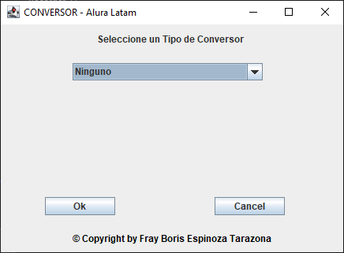
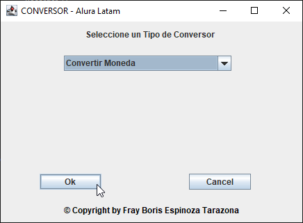
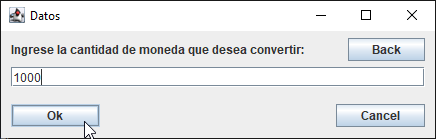
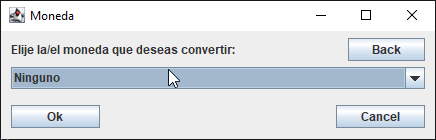
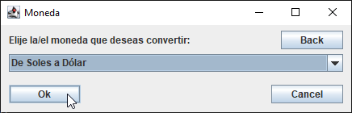
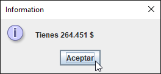
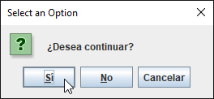

<p align="center">
  
</p>

# CONVERSOR
<p align="left">
  
  
  
  
  
</p>

## Descripción
Este proyecto forma parte del segundo Challenge del programa Alura Latam enfocado en Java Back End el cual consiste en crear un Conversor de Divisas.

## Estado
Finalizado

## Funcionalidades
Permite realizar las siguientes conversiones:
- Moneda
  - Soles a Dólar
  - Soles a Euros
  - Soles a Libras Esterlinas
  - Soles a Yen Japonés
  - Soles a Won Surcoreano
  - Dólar a Soles
  - Euros a Soles
  - Libras Esterlinas a Soles
  - Yen Japonés a Soles
  - Won Surcoreano a Soles
- Temperatura
  - Celsius a Fahrenheit
  - Celsius a Kelvin
  - Celsius a Rankine
  - Fahrenheit a Celsius
  - Kelvin a Celsius
  - Rankine a Celsius
- Peso
  - Toneladas a Kilos
  - Kilos a Gramos
  - Gramos a Miligramos
  - Miligramos a Libras
  - Libras a Onzas
  - Kilos a Toneladas
  - Gramos a Kilos
  - Miligramos a Gramos
  - Libras a Miligramos
  - Onzas a Libras
- Volumen
  - Litros a Mililitros
  - Mililitros a Metros Cubicos
  - Metros Cubicos a Centimetros Cubicos
  - Centimetros Cubicos a Milimetros Cubicos
  - Mililitros a Litros
  - Metros Cubicos a Mililitros
  - Centimetros Cubicos a Metros Cubicos
  - Milimetros Cubicos a Centimetros Cubicos
- Longitud
  - Millas a Kilometros
  - Kilometros a Metros
  - Metros a Centimetros
  - Centimetros a Milimetros
  - Kilometros a Millas
  - Metros a Kilometros
  - Centimetros a Metros
  - Milimetros a Centimetros

## Instalación
### 1era Forma
1. Hacer clic en **Code** y luego en **Download ZIP**

### 2da Forma
1. Crear una carpeta
2. Ingresar a **Git Bash** y ejecutar el siguiente comando
```sh
git clone https://github.com/frayesptar/Conversor.git
```

## Manual de usuario
1. Al ejecutar el programa aparecerá la siguiente pantalla
<p align="center">
  
</p>

2. Seleccionar un Conversor Ej. **"Convertir Moneda"** y hacer clic en **Ok**
<p align="center">
  
</p>

3. Ingresar la cantidad que desea convertir Ej. **"1000"** y hacer clic en **Ok**
<p align="center">
  
</p>

4. Seleccionar un tipo de conversor Ej. **"De Soles a Dólar"** y hacer clic en **Ok**
<p align="center">
  
  <br/>
    
</p>

5. Aparecera un mensaje con el valor convertido Ej. **"Tienes 264.451 $"** y hacer clic en **Aceptar**
<p align="center">
  
</p>

6. Al hacer clic en **Aceptar** aparecerá un mensaje con una pregunta la cual tiene tres opciones:
   - **Si:** Permite volver a la pantalla inicial para seleccionar un nuevo conversor
   - **No:** Finaliza el programa
   - **Cancelar:** Permite volver a la tercera pantalla para seleccionar un nuevo tipo de conversor

7. En esta ocación haremos clic en **Si**
<p align="center">
  
</p>


## Tecnologías utilizadas
- Java

## IDE utilizada
- Eclipse

## Personas desarrolladoras del proyecto
- Fray Boris Espinoza Tarazona
